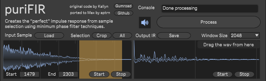

# puriFIR

A Max/MSP port of Kallyn's exquisite puriFIR script - a Minimum Phase Impulse Response Converter.

## Overview

puriFIR is a powerful tool for converting impulse responses to minimum phase, offering basic features like:

- Basic sample import
- Region selection and cropping
- Processing with selectable window size
- Output impulse response export to audio file

## Screenshot



## Getting Started

### Installation

1. Download pre-built artifacts from the [release section](https://github.com/aptrn/puriFIR/releases)
2. Choose your preferred installation method:
   - **Max For Live**: Drag and drop `puriFIR.amxd` into an Ableton Live Audio track.
   - **Standalone**: Unzip `puriFIR.zip` and run `puriFIR.exe`.

### Usage

1.  Load an audio sample by pressing the `Load` button or drag and drop a file into the waveform display. You can preview the sample by using the `Play` and `Stop` buttons.
2.  Optionally select a region to crop using `Start` and `End` numbers or dragging on the waveform display and then presssing the Crop button.
3.  Select the desired `window size` (default at 2048).
4.  Process the sample clicking the `Process` button.
5.  Have a listen to the IR preview using the `Play` and `Stop` buttons and save it to disk by clicking the `Save` button.
6.  Once saved you can then use the IR in your favourite convolution engine (Xfer Serum 2, khs Convolver, Hybrid Reverb etc)

### Original Version

The original FL Studio version is available:

- [Get on Gumroad](https://kallyn.gumroad.com/l/purifir)
- [Watch the Video](https://www.youtube.com/watch?v=Vx4U7zyS-H4)

## Development

### Prerequisites

Before you begin, ensure you have the following installed:

- [Git](https://git-scm.com/downloads)
- [Cycling '74 Max](https://cycling74.com/downloads)
- [Node.js](https://nodejs.org/en/download/)
  - Recommended: Use [nvm for Windows](https://github.com/coreybutler/nvm-windows) or [nvm for Linux/Mac](https://github.com/nvm-sh/nvm)
- [pnpm](https://pnpm.io/installation) (optional, npm can be used instead)
  ```bash
  npm install -g pnpm
  ```

### Building from Source

1. Clone the repository:

   ```bash
   git clone https://github.com/aptrn/puriFIR.git
   cd ./puriFIR
   ```

2. Install dependencies:

   ```bash
   pnpm install
   ```

3. Build the project:

   - One-time build: `pnpm build`
   - Development with live reload: `pnpm dev`

4. Open the Max project file: `puriFIR.maxproj`

### Packaging

After making modifications, you can create distributable packages using Max:

- Use "Build Collective/Application" for standalone builds
- Use "Export Max For Live Device" for Max For Live devices
